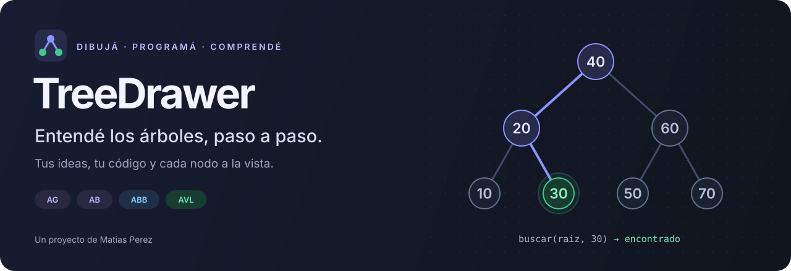
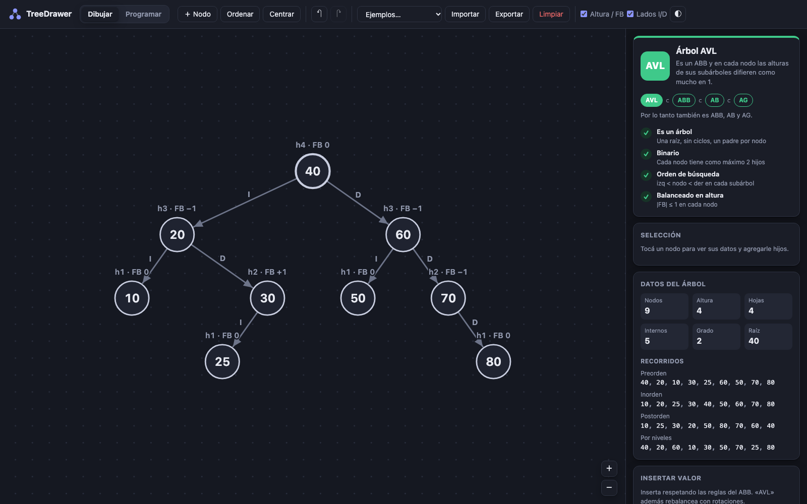
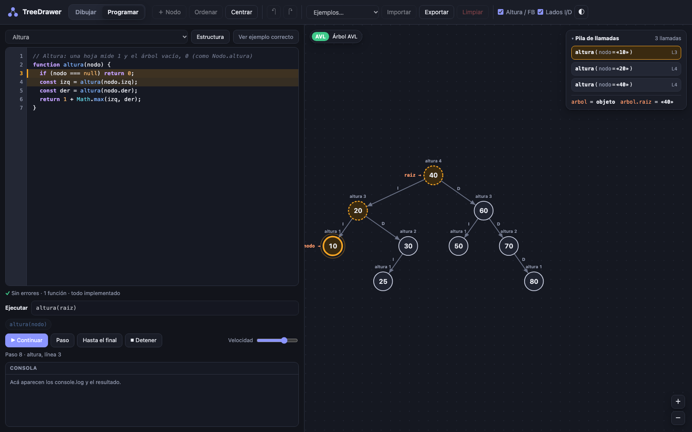

<p align="center">
  
</p>

<p align="center">
  <strong>Una aplicación didáctica para aprender árboles y grafos implementando y viendo cómo funcionan.</strong>
</p>

<p align="center">
  <a href="https://matixv23.github.io/TreeDrawer/"><strong>▶ Probar TreeDrawer</strong></a>
  &nbsp; · &nbsp;
  <a href="#primeros-pasos">Primeros pasos</a>
  &nbsp; · &nbsp;
  <a href="#aprender-programando">Aprender programando</a>
  &nbsp; · &nbsp;
  <a href="#grafos">Grafos</a>
  &nbsp; · &nbsp;
  <a href="#ejecutar-en-local">Ejecutar en local</a>
</p>

<p align="center"><sub>HTML · CSS · JavaScript &nbsp; | &nbsp; Practicá en JavaScript o Java &nbsp; | &nbsp; Sin dependencias &nbsp; | &nbsp; Tema claro y oscuro</sub></p>

---

## Del dibujo al algoritmo

Entender un árbol es más fácil cuando podés **construirlo, modificarlo y seguir cada paso de tu código**. TreeDrawer conecta la teoría de estructuras de datos con la práctica: dibujás un árbol, implementás funciones y observás cómo lo recorren o transforman.

Está pensada para estudiantes y para quienes quieran practicar recursión, búsquedas, recorridos y balanceo con una referencia visual. La idea es que escribas tus propias soluciones y puedas comprender qué está pasando en cada nodo.

Con el selector **Árbol | Grafo** de la barra superior pasás a trabajar con **grafos**: dirigidos o no, con pesos opcionales, y con sus propios ejercicios (BFS, DFS, Dijkstra, Prim y más). Cada espacio guarda su propio dibujo.

| Dibujá y explorá | Programá y comprendé |
| --- | --- |
| Creá nodos, conectalos y reorganizá el árbol. | Completá funciones o trabajá con clases AB, ABB y AVL. |
| Descubrí si es AG, AB, ABB o AVL y por qué. | Ejecutá paso a paso y agregá puntos de interrupción. |
| Consultá altura, hojas, grado y recorridos. | Seguí las variables, la pila de llamadas y los retornos. |
| Probá inserciones en ABB y rotaciones en AVL. | Observá cómo cambia el dibujo al modificar el árbol. |

## Un vistazo a TreeDrawer

### Dibujar: la estructura a la vista



Creá un árbol desde cero o cargá un ejemplo. El panel analiza la estructura y explica las condiciones que cumple y las que le faltan.

### Programar: seguí el recorrido de tu código



La ejecución vincula el código con el dibujo: resalta el nodo actual, muestra las llamadas pendientes y permite inspeccionar cómo avanza la recursión.

## Primeros pasos

1. **[Abrí la aplicación](https://matixv23.github.io/TreeDrawer/)** y elegí **AVL perfecto** en el selector de ejemplos.
2. Activá **Altura / FB** y **Lados I/D** para relacionar cada nodo con sus propiedades.
3. Cambiá un valor o agregá un nodo y observá cómo cambia la clasificación.
4. Entrá en **Programar**, elegí el ejercicio **Altura** y completá la función.
5. Ejecutá `altura(raiz)` con **Paso** para seguir las llamadas y los valores que devuelve cada una.

> Los ejercicios empiezan con un esqueleto para completar. **Ver ejemplo correcto** muestra en el editor una solución de referencia que podés ejecutar paso a paso; **Volver a mi código** te devuelve lo tuyo tal como estaba.

## Qué podés aprender

### Familias de árboles

La aplicación muestra la clasificación más específica que cumple tu dibujo: **AVL ⊂ ABB ⊂ AB ⊂ AG**.

| Tipo | Qué lo caracteriza |
| --- | --- |
| **AG · Árbol general** | Una estructura de árbol que puede tener varios hijos por nodo. |
| **AB · Árbol binario** | Cada nodo tiene, como máximo, dos hijos. |
| **ABB · Árbol binario de búsqueda** | Además, los valores del subárbol izquierdo son menores y los del derecho son mayores, sin claves repetidas. |
| **AVL · Árbol binario de búsqueda balanceado** | Además, la diferencia de alturas entre los subárboles de cada nodo es, como máximo, 1. |

También detecta estructuras que **no son árboles**, como ciclos, múltiples raíces o nodos con más de un padre. Para árboles binarios, indica si son perfectos, completos, llenos o degenerados.

### De la recursión al balanceo

- **Medir:** altura, cantidad de nodos, cantidad de hojas y grado.
- **Recorrer:** preorden, inorden, posorden y por niveles.
- **Buscar:** valores, mínimo, máximo, predecesor y sucesor.
- **Transformar:** insertar, eliminar y construir el espejo de un árbol.
- **Validar y balancear:** comprobar las propiedades de ABB y AVL, calcular factores de balance e implementar rotaciones.

> **Convención de alturas:** árbol vacío = `0`; hoja = `1`.
> El factor de balance es `altura(izq) − altura(der)`.

## Aprender programando

Podés trabajar con **funciones sueltas** o con una **jerarquía de clases**, en **JavaScript o Java**: el selector **JS | Java** está arriba a la derecha del editor.

```text
ArbolBinario
└── ArbolBinarioBusqueda
    └── ArbolAVL
```

Cada clase es un ejercicio aparte: **AB**, **ABB** y **AVL**. En ABB y AVL, las clases madre ya vienen incluidas y resueltas, para que te concentres en la clase del ejercicio. La clase `Nodo` siempre está incluida. Los métodos pendientes lanzan `Error("No implementado")` en JavaScript o `UnsupportedOperationException("No implementado")` en Java hasta que escribas tu solución.

| Referencia | Para qué sirve | Ejemplo de llamada¹ |
| --- | --- | --- |
| `arbol` | Instancia de la clase seleccionada. | `arbol.altura()` |
| `arbol.raiz` | Raíz del árbol dibujado. | `arbol.rotacionDerecha(arbol.raiz)` |
| `raiz` | Atajo de `arbol.raiz` para funciones sueltas. | `altura(raiz)` |

<sub>¹ Las llamadas requieren que hayas implementado el método o la función correspondiente. Si una operación devuelve una nueva raíz, asignala; por ejemplo: <code>arbol.raiz = arbol.rotacionDerecha(arbol.raiz)</code>.</sub>

**Estructura** muestra las clases y firmas del ejercicio en el lenguaje elegido. Indica qué métodos están implementados, pendientes, heredados o faltantes, y permite saltar a su línea, preparar una llamada para probarlos o abrirlos en el ejemplo correcto.

**Ver ejemplo correcto** cambia el editor a una solución de referencia en solo lectura que podés ejecutar como tu propio código. Tu versión queda guardada mientras la página esté abierta, también si cambiás de ejercicio o de lenguaje.

### Mirá qué pasa en cada paso

- **▶ Ejecutar** anima la ejecución; **Paso** avanza una instrucción; **Hasta el final** continúa hasta terminar o encontrar un punto de interrupción.
- Un clic en el número de línea agrega un **breakpoint**.
- El nodo actual se resalta en naranja; los nodos de las llamadas pendientes aparecen punteados.
- La **pila de llamadas** muestra los parámetros y las variables locales. El dibujo también muestra referencias a nodos y retornos.
- Las modificaciones se ven durante la ejecución, incluso a mitad de una rotación. **Detener** recupera el árbol original; después de terminar, podés deshacer el cambio.

<details>
<summary><strong>Referencia de clases y nodos</strong></summary>

| Clase | Contenido |
| --- | --- |
| `Nodo` · incluida | `dato`, `izq`, `der`, `altura`; métodos `getDato/setDato`, `getIzq/setIzq`, `getDer/setDer`, `getAltura/setAltura` y `esHoja()`. Para árboles generales, `hijos`. |
| `ArbolBinario` | `raiz`, `getRaiz`, `estaVacio`, `vaciar`, inserción por nivel, `contiene`, `altura`, conteos y recorridos. |
| `ArbolBinarioBusqueda` | Inserción ordenada, `contiene`, `buscar`, `eliminar`, `minimo`, `maximo`, `predecesor` y `sucesor`. |
| `ArbolAVL` | Inserción y eliminación con rebalanceo, `factorBalance`, `estaBalanceado` y rotaciones simples y dobles. |

En la selección automática, `arbol` usa la clase del ejercicio siempre que el dibujo lo permita: `ArbolBinarioBusqueda` y `ArbolAVL` necesitan un árbol de búsqueda (ABB o AVL) o un lienzo vacío. Si no, usa la clase más específica que encaje con el dibujo.

Los nodos del dibujo llegan con `altura` calculada. En **Programar**, al activar **Altura / FB**, el campo `altura` se muestra en rojo si no coincide con la altura real: una ayuda para depurar el balanceo.

</details>

<details>
<summary><strong>Lenguajes admitidos y límites del intérprete</strong></summary>

La aplicación interpreta un subconjunto de cada lenguaje para poder mostrar la ejecución paso a paso. Ambos comparten el mismo intérprete.

**JavaScript incluye:** clases con `extends`, `super` y `this`; funciones y flechas; `let` y `const`; `if`, `while`, `for` y `for…of`; recursión; arrays y sus métodos habituales; `Map` y `Set`; objetos; template strings; `?.`, `??`, `Math` y `console.log`. El punto y coma es opcional.

**Java incluye:** clases con `extends`, constructores y métodos sobrecargados, `super(...)` y `this(...)`, `private` y `protected`, `this` implícito, tipos (`int` divide como entero y no acepta decimales sin cast), casts, `if`, `while`, `do…while`, `for` y for-each, arrays, `List`/`ArrayList`, `Queue`/`LinkedList`, `ArrayDeque`, `Stack`, `HashMap`/`LinkedHashMap`/`TreeMap` (con `Map.Entry`), `HashSet`/`LinkedHashSet`/`TreeSet`, `Collections.sort`/`reverse`, `compareTo`, `equals`, `Math`, `Integer.MAX_VALUE` y `System.out.println`. `HashMap` y `HashSet` se recorren en orden de inserción. Los genéricos, las anotaciones, `import` e `implements` se aceptan y se ignoran. Los métodos sueltos van con `static`.

**No incluye:** en JavaScript, getters/setters, campos `#privados`, `async` ni módulos; en Java, interfaces propias, clases internas, lambdas, campos `static` ni `PriorityQueue` (en Dijkstra y Prim el mínimo se busca recorriendo); en ambos, `switch` y `try/catch`. Hay un límite de **200 llamadas anidadas**.

Los errores se muestran en español y señalan la línea correspondiente. Por ejemplo, si escribís `arbol.raz`, el intérprete puede sugerir `raiz`.

</details>

## Grafos

Elegí **Grafo** en la barra superior. El lienzo pasa a dibujar vértices y aristas: **Dirigido** agrega sentido a las aristas y **Ponderado** les da un peso entero (doble clic en una arista para cambiarlo). Si en un dirigido hay A → B y B → A, se dibujan curvadas para que no se pisen.

El panel dice qué tipo de grafo es y por qué:

| No dirigido | Dirigido |
| --- | --- |
| **Árbol** (conexo y acíclico), **bosque**, **conexo** con ciclos o **no conexo**. | **DAG** (acíclico), **fuertemente conexo** o dirigido con ciclos. |
| Comprueba si es conexo, acíclico, árbol, bipartito y completo. | Comprueba si es débil y fuertemente conexo, acíclico, árbol con raíz y completo. |
| Etiquetas: `Kn`, regular, euleriano, camino euleriano. | Cuenta componentes fuertes, fuentes y sumideros. |

Cuando algo falla, lo explica con un ejemplo concreto: el ciclo que encontró, las componentes separadas, el par de vecinos que rompe la bipartición, el vértice al que no se llega.

Además muestra los grados y, desde el vértice seleccionado, los recorridos **BFS** y **DFS**, las **distancias** (Dijkstra si es ponderado, cantidad de aristas si no) y el **orden topológico** si es un DAG. Los vecinos se visitan siempre de menor a mayor, igual que en el modo Programar, así podés comparar tu resultado con el del panel.

### Programar con grafos

En **Programar**, con el espacio Grafo, el selector ofrece:

- **Grafo · lista de adyacencia:** implementar la clase `Grafo` (`buscarVertice`, `agregarVertice`, `agregarArista`, `existeArista`, `eliminarArista`, `eliminarVertice`, `adyacentes`, grados y cantidades).
- **Funciones sueltas**, con la clase `Grafo` ya incluida: contar vértices y aristas, grado y grado máximo, vecinos y vértices aislados, peso total y arista más liviana, fuentes y sumideros, ¿es completo?, ¿es bipartito?, camino más corto con BFS, y dos que modifican el grafo: quitar los vértices aislados e invertir las aristas.
- **Algoritmos**, también con `Grafo` incluida: BFS y DFS, existe camino, conexo y componentes, tiene ciclo, orden topológico, Dijkstra y Prim.
- **Hoja en blanco:** para escribir tus propias funciones sobre `grafo`, con `Grafo` incluida. Si definís tu propia clase `Grafo`, reemplaza a la incluida.

Como en los árboles, cada ejercicio empieza con las firmas y los cuerpos vacíos, y **Ver ejemplo correcto** abre una solución que podés ejecutar paso a paso.

| Referencia | Para qué sirve | Ejemplo de llamada |
| --- | --- | --- |
| `grafo` | Instancia de la clase elegida en «grafo es un», con el grafo dibujado. | `grafo.adyacentes(1)` |
| `grafo.vertices` | Un `Vertice` por vértice dibujado, en orden creciente. | `bfs(grafo, 1)` |

`Vertice` (`dato`, `adyacentes`, `visitado`) y `Arista` (`destino`, `peso`) vienen incluidas y están conectadas al dibujo. En un grafo no dirigido, cada arista está en la lista de adyacentes de sus dos vértices. La línea de ejecución sugerida usa vértices que existen en tu dibujo: si son letras, queda por ejemplo `bfs(grafo, "A")`.

Mientras corre el código se ve:

- el vértice que se está procesando, en naranja;
- los visitados, marcados con el campo `visitado` o con un conjunto llamado `visitados`;
- los que están en una cola o pila, punteados en azul;
- la arista que se está mirando, resaltada;
- las colecciones del paso actual como etiquetas bajo cada vértice, por ejemplo `dist 4`, `cola[0]` o `∈ enCurso`.

Al terminar, si el resultado es un recorrido, los vértices quedan numerados en ese orden.

Si tu código deja una arista en un solo sentido en un grafo no dirigido, aparece con flecha naranja punteada y un aviso en la consola. También se marcan las aristas repetidas y los pesos de ida y vuelta distintos. Si un vértice sale de `grafo.vertices` pero todavía le llegan aristas, queda punteado.

## Controles

| Acción | Control |
| --- | --- |
| Crear un nodo | Doble clic en el lienzo, **＋ Nodo** o `N` |
| Editar un valor | Doble clic en el nodo o `Enter` |
| Mover un nodo | Arrastrarlo |
| Conectar padre → hijo | Arrastrar desde el punto inferior del padre hasta el hijo, o `Shift` + arrastrar |
| Crear un hijo | Arrastrar desde el punto inferior y soltar en un espacio vacío |
| Borrar la selección | `Supr` / `⌫` |
| Mover la vista / hacer zoom | Arrastrar el fondo / rueda del mouse |
| Ordenar / centrar | `L` / `F` |
| Deshacer / rehacer | `Ctrl/⌘ + Z` / `Ctrl/⌘ + Shift + Z` |

En el espacio **Grafo**, arrastrar desde el punto inferior crea una **arista** hacia otro vértice, o un vértice adyacente si soltás en un espacio vacío. En un grafo ponderado se pide el peso al crearla; **doble clic en una arista** lo cambia. **Ordenar** distribuye los vértices automáticamente. No se admiten lazos ni aristas repetidas.

**La posición determina el lado de un hijo.** Si hay uno solo, es izquierdo o derecho según su posición respecto del padre. Si hay dos, el de más a la izquierda es el izquierdo. Activá **Lados I/D** para ver las etiquetas en las aristas.

## Guardar y retomar

El **dibujo se guarda automáticamente** en el navegador mediante `localStorage`. El árbol y el grafo se guardan por separado, cada uno con su propio historial para deshacer. También podés exportarlos e importarlos en JSON para conservar ejemplos o compartirlos: al importar un grafo, la aplicación cambia sola al espacio Grafo.

**El código del editor no se guarda al recargar la página:** vuelve al esqueleto inicial. Mientras la página está abierta, cada ejercicio conserva tu código en cada lenguaje. Copiá tus implementaciones a un archivo si querés retomarlas después.

## Ejecutar en local

Descargá o cloná el repositorio y abrí **`index.html`** en tu navegador. No necesitás instalar dependencias ni compilar.

```bash
git clone https://github.com/MatiXV23/TreeDrawer.git
cd TreeDrawer
```

Si preferís usar un servidor local y tenés Python 3:

```bash
python3 -m http.server 8000
```

Luego abrí [localhost:8000](http://localhost:8000).

<details>
<summary><strong>Estructura del proyecto</strong></summary>

```text
TreeDrawer/
├── index.html                 Interfaz principal
├── css/styles.css             Estilos y temas claro/oscuro
├── docs/assets/               Logo, portada y capturas del README
└── js/
    ├── analysis.js            Clasificación y propiedades de árboles
    ├── layout.js              Distribución automática de nodos
    ├── graph.js               Análisis, recorridos, distribución y ejemplos de grafos
    ├── state.js               Estado, historial y persistencia (árbol y grafo)
    ├── examples.js            Árboles de ejemplo
    ├── app.js                 Lienzo SVG, interacción y panel
    ├── editor.js              Editor, resaltado y breakpoints
    ├── runner.js              Ejecución y visualización paso a paso
    ├── guide.js               Modal «Estructura a implementar»
    └── lang/
        ├── parser.js          Parser del subconjunto de JavaScript
        ├── java-parser.js     Parser del subconjunto de Java (mismo AST)
        ├── interpreter.js     Intérprete paso a paso (JavaScript y Java)
        ├── examples.js        Ejercicios, esqueletos y referencias (árboles)
        └── graph-examples.js  Ejercicios de grafos: clase Grafo y algoritmos
```

</details>

---

<p align="center">
  <br>
  <strong>TreeDrawer</strong><br>
  Desarrollado por <strong>Matias Perez</strong><br>
  <a href="https://github.com/MatiXV23">@MatiXV23</a>
</p>
